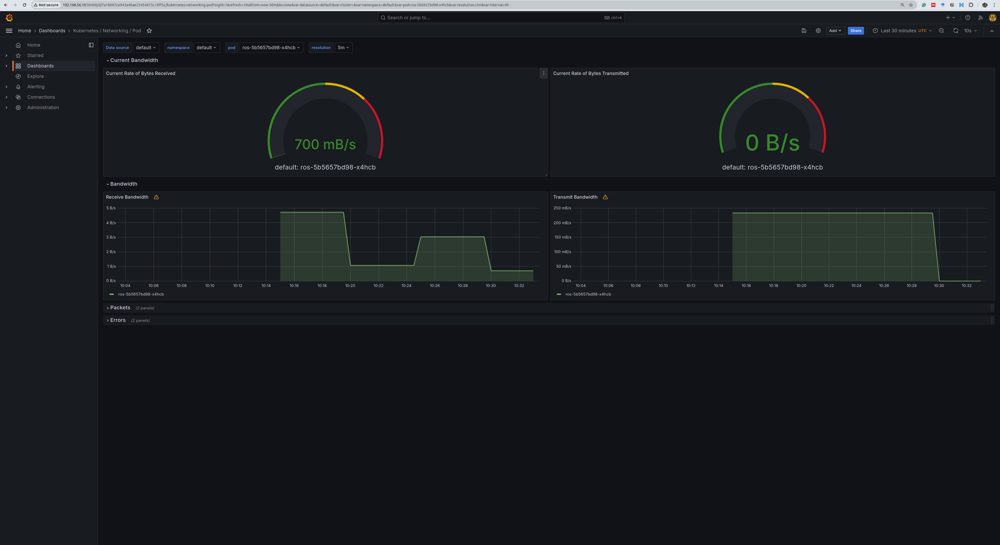
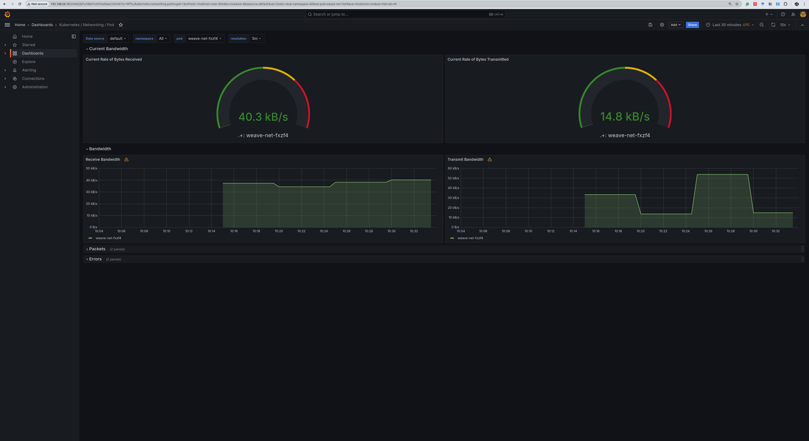

# Monitoring System

## Table of Contents

- [Monitoring System](#monitoring-system)
  - [Table of Contents](#table-of-contents)
    - [Install Metrics Server](#install-metrics-server)
    - [Install Kubernetes Dashboard](#install-kubernetes-dashboard)
    - [Kubernetes Dashboard Access](#kubernetes-dashboard-access)
    - [Helm](#helm)
    - [Prometheus](#prometheus)
      - [Add the Prometheus Helm Chart Repository](#add-the-prometheus-helm-chart-repository)
      - [kubectl create namespace prometheus](#kubectl-create-namespace-prometheus)
      - [Install Prometheus using Helm](#install-prometheus-using-helm)
      - [Access Prometheus](#access-prometheus)
    - [Grafana](#grafana)


### Install Metrics Server

```shell
vagrant ssh controlplane
kubectl apply -f https://github.com/kubernetes-sigs/metrics-server/releases/latest/download/components.yaml
```

or

```shell
vagrant ssh controlplane
kubectl apply -f https://raw.githubusercontent.com/techiescamp/kubeadm-scripts/main/manifests/metrics-server.yaml
```

### Install Kubernetes Dashboard

```shell
kubectl apply -f https://raw.githubusercontent.com/kubernetes/dashboard/v2.7.0/aio/deploy/recommended.yaml
```

### Kubernetes Dashboard Access

Make the dashboard accessible:
```shell
vagrant ssh controlplane
kubectl proxy
```

```bash
kubectl apply -f ./yaml/admin-user.yaml
kubectl -n kubernetes-dashboard get secret/admin-user -o go-template="{{.data.token | base64decode}}" >> "token"
```
Or
```bash
kubectl -n kubernetes-dashboard describe secret $(kubectl -n kubernetes-dashboard get secret | grep admin-user | awk '{print $1}')
```

Open the site in your browser:

https://192.168.56.10:30664/#/login


### Helm

https://helm.sh/docs/intro/install/


```shell
vagrant ssh controlplane
curl https://baltocdn.com/helm/signing.asc | gpg --dearmor | sudo tee /usr/share/keyrings/helm.gpg > /dev/null
sudo apt-get install apt-transport-https --yes
echo "deb [arch=$(dpkg --print-architecture) signed-by=/usr/share/keyrings/helm.gpg] https://baltocdn.com/helm/stable/debian/ all main" | sudo tee /etc/apt/sources.list.d/helm-stable-debian.list
sudo apt-get update
sudo apt-get install helm
```

### Prometheus

#### Add the Prometheus Helm Chart Repository

```bash
helm repo add prometheus-community https://prometheus-community.github.io/helm-charts
helm repo update
```
#### kubectl create namespace prometheus

```bash
kubectl create namespace prometheus
```

#### Install Prometheus using Helm

```bash
helm install prometheus prometheus-community/kube-prometheus-stack -n prometheus
```

```bash
kubectl get pods -n prometheus
```

```bash
kubectl get svc -n prometheus
```

if you want to access the Prometheus dashboard, you can port-forward the Prometheus pod to your local machine:
```bash
kubectl --namespace prometheus port-forward deploy/prometheus-kube-prometheus-prometheus 9090
```
Now, you can access the Prometheus dashboard by navigating to http://localhost:9090 in your web browser.

Or you can change the service type to NodePort or LoadBalancer:
```bash
kubectl -n prometheus edit service prometheus-kube-prometheus-prometheus
```
In the editor, change type: ClusterIP to type: **NodePort** or type: LoadBalancer. Save and exit.
For remote server, you can use the LoadBalancer type.


#### Access Prometheus

http://192.168.56.10:31334

Username: admin

Password: prom-operator

### Grafana

http://192.168.56.10:30400







