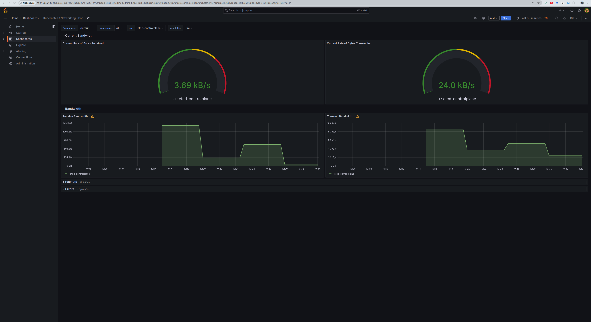
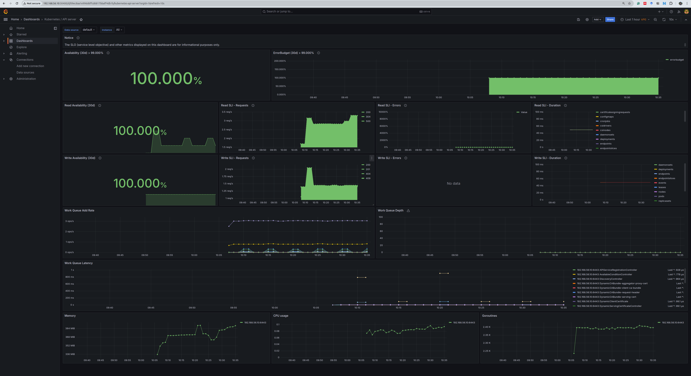

# Monitoring System

## Table of Contents

- [Monitoring System](#monitoring-system)
  - [Table of Contents](#table-of-contents)
  - [Overview](#overview)
  - [Key Components of the Monitoring System](#key-components-of-the-monitoring-system)
    - [Metrics Server](#metrics-server)
    - [Kubernetes Dashboard](#kubernetes-dashboard)
      - [Dashboard Access and Security](#dashboard-access-and-security)
    - [Prometheus and Grafana](#prometheus-and-grafana)
      - [Helm Installation](#helm-installation)
      - [Prometheus and Grafana Setup](#prometheus-and-grafana-setup)
        - [Add the Prometheus Helm Chart Repository](#add-the-prometheus-helm-chart-repository)
        - [Install Prometheus and Grafana Helm Chart](#install-prometheus-and-grafana-helm-chart)
        - [Persistent Volume Configuration](#persistent-volume-configuration)
        - [Verifying the Installation](#verifying-the-installation)
        - [Access Prometheus](#access-prometheus)
      - [Grafana](#grafana)
  - [Access URLs and Credentials](#access-urls-and-credentials)


## Overview

This project uses Vagrant alongside bash scripts to automate the creation and configuration of virtual machines (VMs) in VirtualBox. This setup includes a Kubernetes cluster with a comprehensive monitoring system. The included `Vagrantfile` and various scripts handle the entire setup process, negating the need for manual configuration commands.

## Key Components of the Monitoring System

### Metrics Server

The Metrics Server is a scalable, efficient source of container resource metrics for Kubernetes built-in autoscaling pipelines. The Metrics Server plays a crucial role in Kubernetes monitoring and management systems due to its ability to provide core metrics about clusters, which include metrics on CPU and memory usage for nodes and pods. The Metrics Server is installed using a direct `kubectl apply -f` command, fetching the latest components from the official GitHub repository.

```shell
vagrant ssh controlplane
kubectl apply -f https://github.com/kubernetes-sigs/metrics-server/releases/latest/download/components.yaml
```

or

```shell
vagrant ssh controlplane
kubectl apply -f https://raw.githubusercontent.com/techiescamp/kubeadm-scripts/main/manifests/metrics-server.yaml
```

### Kubernetes Dashboard

The Kubernetes Dashboard offers a web-based Kubernetes user interface. It allows users to manage applications running in the cluster and troubleshoot them, as well as manage the cluster itself. Installation is performed through `kubectl apply -f` from the Kubernetes official repository.

```shell
kubectl apply -f https://raw.githubusercontent.com/kubernetes/dashboard/v2.7.0/aio/deploy/recommended.yaml
```

https://github.com/kubernetes/dashboard
https://kubernetes.io/docs/tasks/access-application-cluster/web-ui-dashboard/

#### Dashboard Access and Security

After installing the Kubernetes Dashboard, an `admin-user` is set up to facilitate access. The admin credentials and access token are configured and retrieved within the script, enabling secure login to the dashboard.

The token needed for login can be located in the `token` file. This file is automatically generated and can be found in the `./MonitoringSystem/` directory. You can find it in the `vagrant.log` file if you used the `vagrant up | tee vagrant.log` command. Alternatively, you can use the following command to obtain the token:
  
  ```shell
kubectl -n kubernetes-dashboard describe secret $(kubectl -n kubernetes-dashboard get secret | grep admin-user | awk '{print $1}')
```
Open the site in your browser: https://192.168.56.10:30664/#/login


### Prometheus and Grafana

#### Helm Installation

Helm, the package manager for Kubernetes, is installed using a script that downloads and configures the necessary repositories and packages. This tool is crucial for managing Kubernetes applications, including Prometheus and Grafana.

```shell
vagrant ssh controlplane
curl https://baltocdn.com/helm/signing.asc | gpg --dearmor | sudo tee /usr/share/keyrings/helm.gpg > /dev/null
sudo apt-get install apt-transport-https --yes
echo "deb [arch=$(dpkg --print-architecture) signed-by=/usr/share/keyrings/helm.gpg] https://baltocdn.com/helm/stable/debian/ all main" | sudo tee /etc/apt/sources.list.d/helm-stable-debian.list
sudo apt-get update
sudo apt-get install helm
```

#### Prometheus and Grafana Setup

Prometheus, a powerful monitoring and alerting toolkit, is integrated into the system using Helm. The script includes commands to add the Prometheus Helm chart repository, update it, and install Prometheus with custom configurations (`--values /home/vagrant/codes/MonitoringSystem/kube-prometheus-stack-values.yaml`) to adjust its default settings, like changing the service type to `NodePort` to allow external access.

Configuration changes:

- Grafana:
  - service type: from `ClusterIP` to `NodePort`
  - `PersistentVolumeClaim`

- Prometheus:
  - service type: from `ClusterIP` to `NodePort`
  - `PersistentVolumeClaim`
  - Retention: How long to retain metrics `retention: 1y` 


##### Add the Prometheus Helm Chart Repository

```bash
helm repo add prometheus-community https://prometheus-community.github.io/helm-charts
helm repo update
```

##### Install Prometheus and Grafana Helm Chart


```bash
# Creating Persistent Volume for Prometheus and Grafana
kubectl apply -f /home/vagrant/codes/MonitoringSystem/pv.yaml

# Creating namespace for Prometheus
kubectl create namespace prometheus

# Installing Prometheus and Grafana using Helm
helm install prometheus prometheus-community/kube-prometheus-stack -n prometheus --values /home/vagrant/codes/MonitoringSystem/kube-prometheus-stack-values.yaml
``` 
##### Persistent Volume Configuration

The script also sets up necessary persistent volumes for Prometheus and Grafana, ensuring data persistence across pod restarts and deletions. This is crucial for maintaining historical data for analysis.

##### Verifying the Installation
```bash
kubectl get all -n prometheus
```


##### Access Prometheus

http://192.168.56.10:31334
Username: admin
Password: prom-operator


#### Grafana

Grafana is used for visualization and analytics of metrics gathered from Prometheus. It is installed and configured similarly to Prometheus, using Helm. The script sets up persistent volumes required for storing data and ensures that Grafana is accessible via a NodePort.

http://192.168.56.10:30400






## Access URLs and Credentials

- **Kubernetes Dashboard**: https://192.168.56.10:30664/#/login
- **Prometheus**: [http://192.168.56.10:31334](http://192.168.56.10:31334/) (Username: admin, Password: prom-operator)
- **Grafana**: [http://192.168.56.10:30400](http://192.168.56.10:30400/)

For more detailed information on the monitoring setup and modifications, refer to the `./MonitoringSystem/monitoring.sh` in the repository.