# Deploying ROS2 Talker and Listener Nodes on a Kubernetes Cluster with Vagrant: A Step-by-Step Guide
Welcome to this tutorial! Here, we will walk you through the process of setting up a Kubernetes cluster with one control plane node and two worker nodes. We will be using Ubuntu 22.04 as the host operating system.
But that's not all! We will also demonstrate how to run a simple ROS2 talker and listener scenario on this cluster. This will serve as a practical example of inter-node communication within the cluster.
This guide is designed to be comprehensive and easy to follow. Whether you're a seasoned Kubernetes user or a beginner, you'll find valuable insights and knowledge here. So, let's get started!

## Table of Contents

- [Deploying ROS2 Talker and Listener Nodes on a Kubernetes Cluster with Vagrant: A Step-by-Step Guide](#deploying-ros2-talker-and-listener-nodes-on-a-kubernetes-cluster-with-vagrant-a-step-by-step-guide)
  - [Table of Contents](#table-of-contents)
  - [Prerequisites](#prerequisites)
    - [Installation of VirtualBox](#installation-of-virtualbox)
    - [Installation of Vagrant](#installation-of-vagrant)
  - [Creating VMs and Setting up the Kubernetes Cluster](#creating-vms-and-setting-up-the-kubernetes-cluster)
    - [Kubeadm](#kubeadm)
  - [Container Network Interface Plugin](#container-network-interface-plugin)
  - [ROS2 Talker and Listener Nodes](#ros2-talker-and-listener-nodes)
    - [Deploying the ROS2 Nodes](#deploying-the-ros2-nodes)
    - [Testing the ROS2 Nodes](#testing-the-ros2-nodes)
  - [Cluster](#cluster)
    - [Shutdown the Cluster](#shutdown-the-cluster)
    - [Restart the Cluster](#restart-the-cluster)
    - [Destroy the Cluster](#destroy-the-cluster)
  - [Monitoring](#monitoring)
    - [Install Metrics Server](#install-metrics-server)
    - [Install Kubernetes Dashboard](#install-kubernetes-dashboard)
    - [Kubernetes Dashboard Access](#kubernetes-dashboard-access)
    - [Helm](#helm)
    - [Prometheus](#prometheus)
      - [Add the Prometheus Helm Chart Repository](#add-the-prometheus-helm-chart-repository)
      - [kubectl create namespace prometheus](#kubectl-create-namespace-prometheus)
      - [Install Prometheus using Helm](#install-prometheus-using-helm)
      - [Access Prometheus](#access-prometheus)
    - [Grafana](#grafana)

## Prerequisites
- VirtualBox
- Vagrant

### Installation of VirtualBox

For installing the VirtualBox use the following commands:

```bash
sudo apt update && sudo apt upgrade -y
sudo apt install virtualbox -y
```

or use the following link to download the VirtualBox:

https://www.virtualbox.org/wiki/Linux_Downloads

https://download.virtualbox.org/virtualbox/7.0.14/virtualbox-7.0_7.0.14-161095~Ubuntu~jammy_amd64.deb

### Installation of Vagrant

For installing the Vagrant use the following commands:

```bash
sudo apt update && sudo apt upgrade -y
wget -O- https://apt.releases.hashicorp.com/gpg | sudo gpg --dearmor -o /usr/share/keyrings/hashicorp-archive-keyring.gpg
echo "deb [signed-by=/usr/share/keyrings/hashicorp-archive-keyring.gpg] https://apt.releases.hashicorp.com $(lsb_release -cs) main" | sudo tee /etc/apt/sources.list.d/hashicorp.list
sudo apt update && sudo apt install vagrant
```

Verify the Installation

```bash
vagrant --version
```

## Creating VMs and Setting up the Kubernetes Cluster

This project uses Vagrant to automatically create and configure three virtual machines (VMs) in VirtualBox. These VMs will serve as the nodes for our Kubernetes cluster:

1. `controlplane`: This is the control plane node of the Kubernetes cluster. It manages the state of the cluster, such as which nodes are part of the cluster, what applications are running, and their desired state.
2. `worker1` and `worker2`: These are the worker nodes where your applications will be deployed.

The configuration for these VMs is specified in the [`Vagrantfile`](Vagrantfile). For each VM, we have defined the following settings:

- `vm.network`: The private network IP address of the VM.
- `vm.hostname`: The internal hostname of the VM.
- `vb.name`: The name of the VM as displayed in VirtualBox.
- `vb.memory`: The amount of memory (in MB) allocated to the VM.
- `vb.cpus`: The number of CPUs allocated to the VM.

You can adjust these settings to suit your needs.

To create the VMs and set up the Kubernetes cluster, run the following command in your terminal:

```sh
git clone git@github.com:MSKazemi/Vagrant-Kubernetes-ROS2-Deployment.git
cd Vagrant-Kubernetes-ROS2-Deployment
vagrant up
```

This command will read the ``Vagrantfile`` in your current directory and create the VMs as specified. It will also execute the provisioning scripts defined in the ``Vagrantfile`` to install necessary packages, set up the Kubernetes cluster, and join the worker nodes to the cluster.

After running this command, you should have a fully functional Kubernetes cluster ready for use!

### Kubeadm

The Kubernetes cluster in this project is set up using `kubeadm`. The `kubeadm` tool is used in the `create_cluster.sh` script to initialize the control plane node with the command `sudo kubeadm init --apiserver-advertise-address=192.168.56.10 --pod-network-cidr=10.244.0.0/16`.

After the control plane node is initialized, a join command is generated with `kubeadm token create --print-join-command` and saved to `/vagrant/join-command.sh`. This command is used to join the worker nodes to the cluster.

The `kubeadm` tool is also installed on all nodes as part of the provisioning process defined in the `Vagrantfile` and the `kubeadm_kubelet_kubectl.sh` script.

## Container Network Interface Plugin

In this project, we use Weave Net as our Container Network Interface (CNI) plugin. Weave Net is a powerful cloud native networking toolkit for Kubernetes. It provides a simple and efficient way to connect PODs across Kubernetes clusters.

After setting up the Kubernetes cluster, you need to connect to the control plane node and install the Weave Net plugin. Here are the steps:

1. Connect to the control plane node using Vagrant:

    ```sh
    vagrant ssh controlplane
    ```

2. Install the Weave Net plugin. This command will download and apply the Weave Net Kubernetes CNI YAML file:

    ```sh
    kubectl apply -f https://github.com/weaveworks/weave/releases/download/v2.8.1/weave-daemonset-k8s.yaml
    ```

After installing the Weave Net plugin, you should verify that all nodes and pods in your Kubernetes cluster are running correctly:

1. Check the status of all nodes in the cluster:

    ```sh
    kubectl get nodes -o wide
    ```

    All nodes should be in the `Ready` state.

2. Check the status of all pods in the cluster:

    ```sh
    kubectl get pods -A -o wide
    ```

    All pods should be in the `Running` state, and there should be no errors.

By following these steps, you can ensure that your Kubernetes cluster is correctly networked and ready for deploying applications.

## ROS2 Talker and Listener Nodes

This section will guide you through deploying ROS2 Talker and Listener nodes on the Kubernetes cluster. These nodes will allow you to test inter-node communication within the cluster.

### Deploying the ROS2 Nodes

1. Navigate to the `yaml` directory and apply the `ros_dep.yaml` file to create a deployment:

    ```bash
    cd ./yaml
    kubectl apply -f ros_dep.yaml
    ```

2. Scale the deployment to create multiple replicas of the ROS2 nodes:

    ```bash
    kubectl scale deployment ros --replicas=3
    ```

### Testing the ROS2 Nodes

1. Check the names of the pods running the ROS2 nodes:

    ```bash
    kubectl get pods
    ```

2. Attach to one of the pods:

    ```bash
    kubectl exec -it <pod-name> -- /bin/bash
    ```

3. Once inside the pod, source the ROS2 environment and start the talker node:

    ```bash
    source /opt/ros/foxy/setup.bash
    ros2 run demo_nodes_cpp talker
    ```

4. In a separate terminal, attach to another pod and start the listener node:

    ```bash
    kubectl exec -it <another-pod-name> -- /bin/bash
    ```
    
    ```bash
    source /opt/ros/foxy/setup.bash
    ros2 run demo_nodes_cpp listener
    ```

You should see the talker node publishing messages and the listener node receiving them. This confirms that the communication between the nodes is functioning correctly.

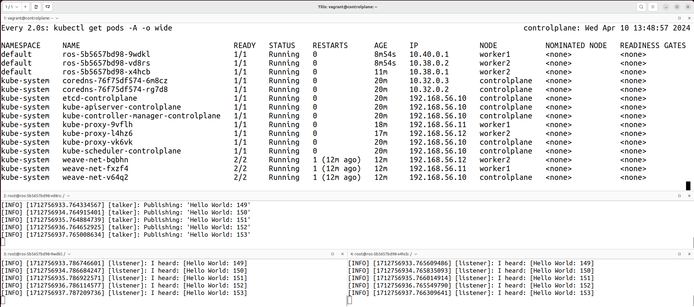

## Cluster

### Shutdown the Cluster

```shell
vagrant halt
```

### Restart the Cluster

```shell
vagrant up
```

### Destroy the Cluster

```shell
vagrant destroy -f
```

## Monitoring

### Install Metrics Server

```shell
vagrant ssh controlplane
kubectl apply -f https://github.com/kubernetes-sigs/metrics-server/releases/latest/download/components.yaml
```

or

```shell
vagrant ssh controlplane
kubectl apply -f https://raw.githubusercontent.com/techiescamp/kubeadm-scripts/main/manifests/metrics-server.yaml
```

### Install Kubernetes Dashboard

```shell
kubectl apply -f https://raw.githubusercontent.com/kubernetes/dashboard/v2.7.0/aio/deploy/recommended.yaml
```

### Kubernetes Dashboard Access

Make the dashboard accessible:
```shell
vagrant ssh controlplane
kubectl proxy
```

Open the site in your browser:

https://192.168.56.10:30664/#/login

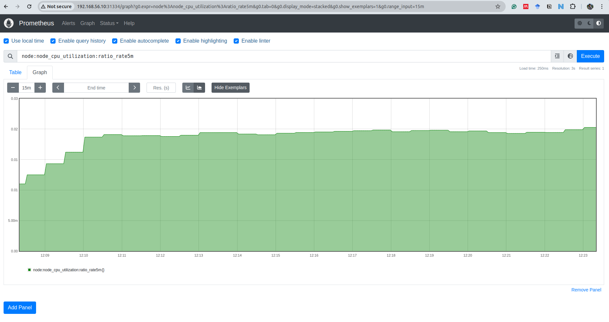

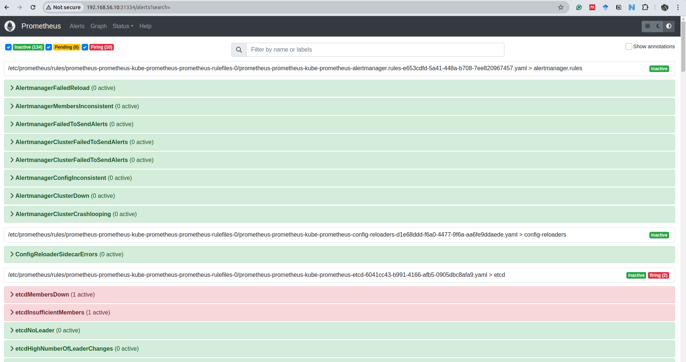

### Helm

https://helm.sh/docs/intro/install/


```shell
vagrant ssh controlplane
curl https://baltocdn.com/helm/signing.asc | gpg --dearmor | sudo tee /usr/share/keyrings/helm.gpg > /dev/null
sudo apt-get install apt-transport-https --yes
echo "deb [arch=$(dpkg --print-architecture) signed-by=/usr/share/keyrings/helm.gpg] https://baltocdn.com/helm/stable/debian/ all main" | sudo tee /etc/apt/sources.list.d/helm-stable-debian.list
sudo apt-get update
sudo apt-get install helm
```

### Prometheus

#### Add the Prometheus Helm Chart Repository

```bash
helm repo add prometheus-community https://prometheus-community.github.io/helm-charts
helm repo update
```
#### kubectl create namespace prometheus

```bash
kubectl create namespace prometheus
```

#### Install Prometheus using Helm

```bash
helm install prometheus prometheus-community/kube-prometheus-stack -n prometheus
```

```bash
kubectl get pods -n prometheus
```

```bash
kubectl get svc -n prometheus
```

```bash
kubectl -n prometheus edit service prometheus-kube-prometheus-prometheus
```
In the editor, change type: ClusterIP to type: **NodePort** or type: LoadBalancer. Save and exit.

#### Access Prometheus

http://192.168.56.10:31334

### Grafana

http://192.168.56.10:30400

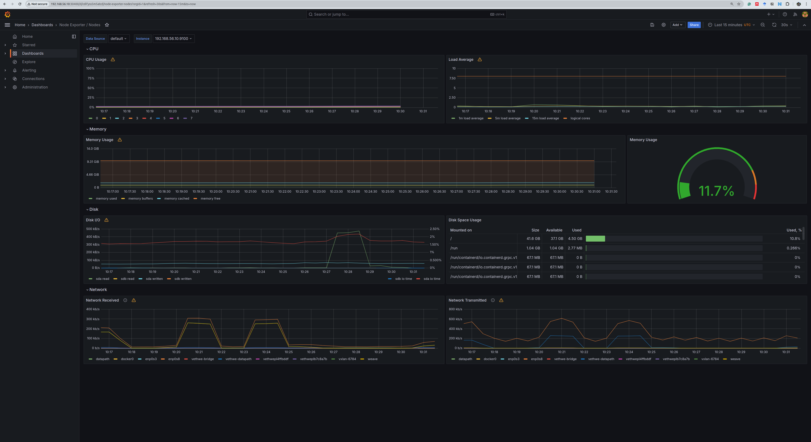

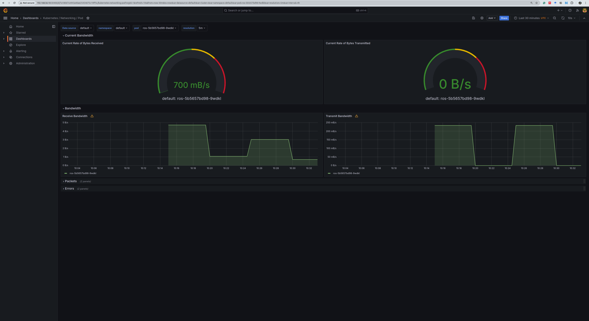

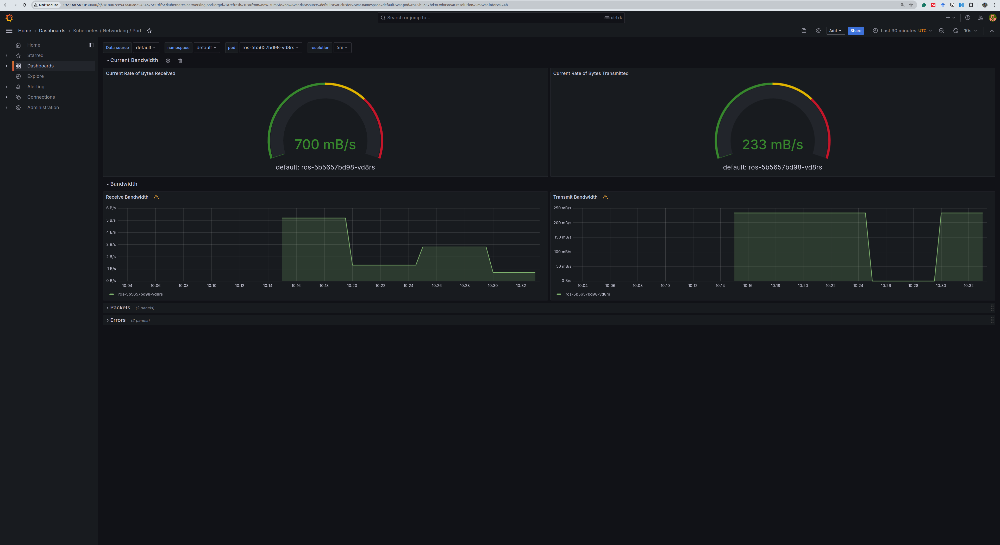

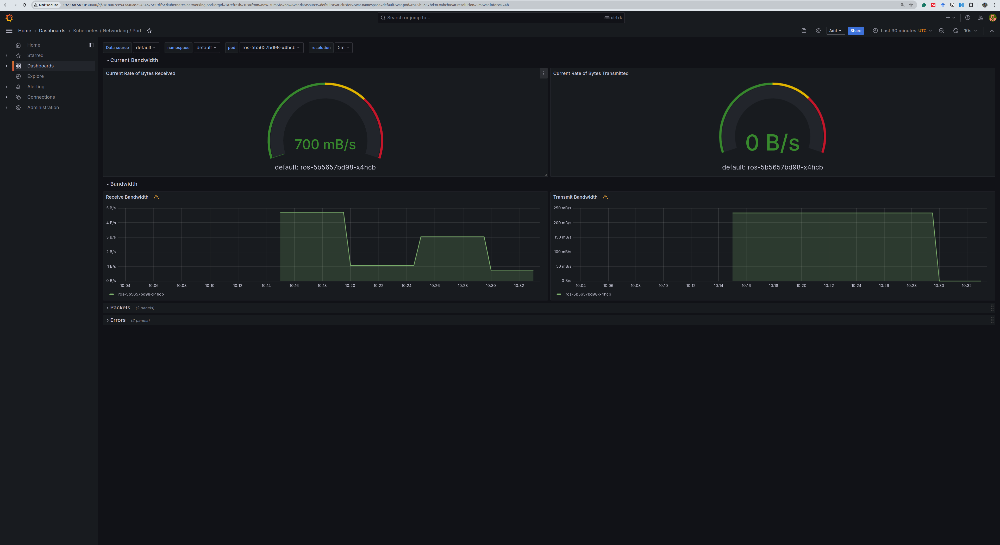

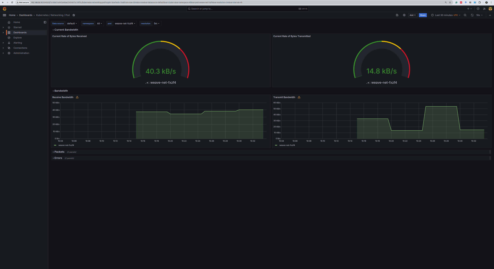

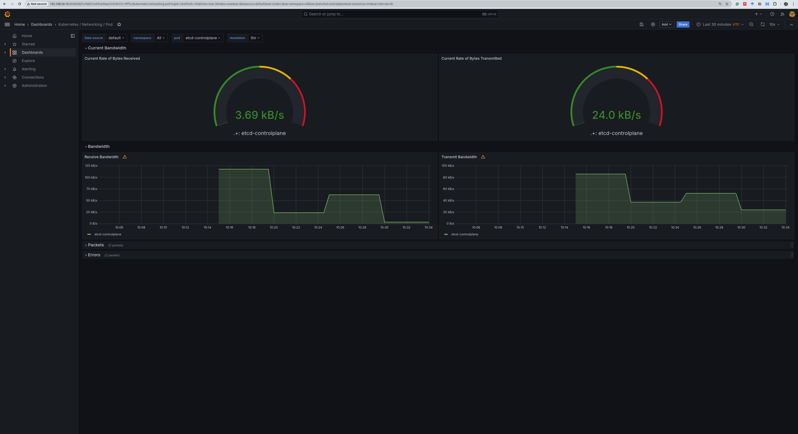

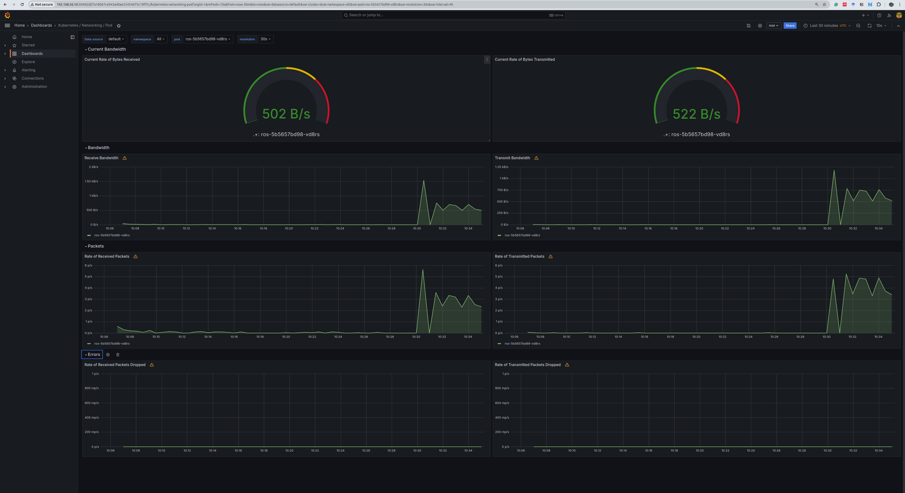

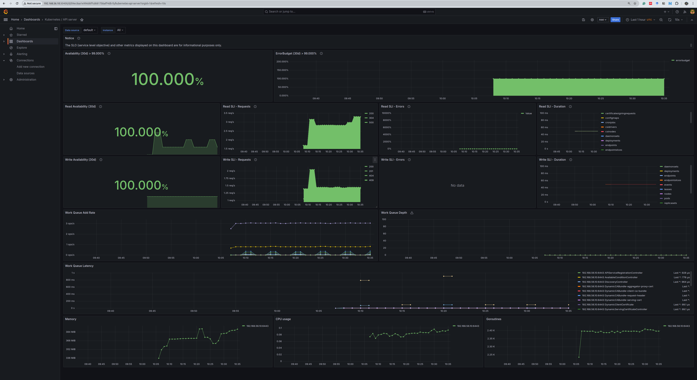