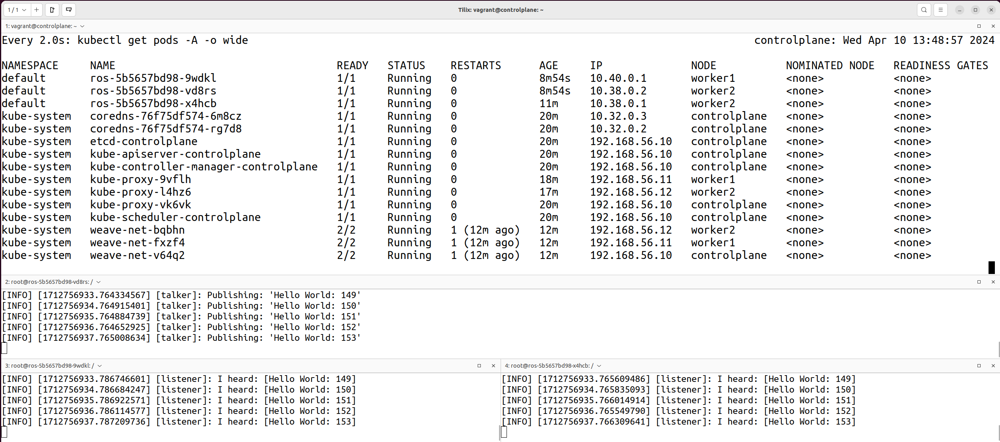

# Deploying ROS2 Talker and Listener Nodes on a Kubernetes Cluster

## Table of Contents

- [Deploying ROS2 Talker and Listener Nodes on a Kubernetes Cluster](#deploying-ros2-talker-and-listener-nodes-on-a-kubernetes-cluster)
  - [Table of Contents](#table-of-contents)
  - [Overview](#overview)
    - [ROS2 (Robot Operating System 2)](#ros2-robot-operating-system-2)
    - [ROS2 Nodes vs. Kubernetes Nodes:](#ros2-nodes-vs-kubernetes-nodes)
      - [ROS2 Node:](#ros2-node)
      - [Kubernetes Node:](#kubernetes-node)
  - [ROS2 Talker and Listener Nodes](#ros2-talker-and-listener-nodes)
    - [Deploying the ROS2 Nodes](#deploying-the-ros2-nodes)
    - [Testing the ROS2 Nodes](#testing-the-ros2-nodes)

## Overview

In this guide, we demonstrate how to deploy and manage ROS2 Talker and Listener nodes on a Kubernetes cluster. This setup is a practical example of facilitating ROS2 inter-node communication within a cluster.

### ROS2 (Robot Operating System 2) 

ROS2 is an open-source framework designed for building and managing complex robotic systems. It's an evolution of the original ROS, incorporating lessons learned from the previous version and updated to handle the demands of modern robotics, including real-time systems, more modular software architecture, and support for new hardware. ROS2 Communication Middleware, built on the Data Distribution Service (DDS), provides a robust method for managing message passing between nodes. This guide will demonstrate how to deploy ROS2 nodes on a Kubernetes cluster, showcasing the communication capabilities of ROS2 in a cloud environment.

### ROS2 Nodes vs. Kubernetes Nodes:

When discussing nodes in the context of ROS2 and Kubernetes, we are referring to different concepts, as "node" is a term used broadly in computing to refer to different components depending on the system or architecture in discussion.

#### ROS2 Node:

In ROS2, a node is a fundamental component that performs computation. A single ROS2 node can be thought of as a process that performs a specific task or a group of related functionalities within a robotic system. For example, one node might handle laser data processing while another manages motor control. Nodes communicate with each other using a publish-subscribe messaging model, services, or actions over topics.

#### Kubernetes Node:

In Kubernetes, a node is a physical or virtual machine that is part of the Kubernetes cluster. Each node hosts multiple pods, which are the smallest deployable units managed by Kubernetes. A Kubernetes node provides the necessary resources (CPU, memory, network connectivity) to run the pods. Kubernetes nodes are managed by a control plane (or master), which handles scheduling, deployment, and orchestration of containers across the nodes in the cluster.


## ROS2 Talker and Listener Nodes

The ROS2 Talker and Listener nodes demonstrate a fundamental communication pattern in robotics systems using the ROS2 framework. The Talker node is designed to publish messages, typically containing data such as sensor readings or status information, to a specific topic. In contrast, the Listener node subscribes to that topic to receive the messages sent by the Talker. This simple yet powerful publish-subscribe model allows for decoupled and asynchronous communication between different parts of a robotic system. By employing ROS2's robust middleware, these nodes can reliably exchange information, making them vital components in the orchestration of complex behaviors and interactions within robotic applications. This model not only facilitates straightforward data sharing but also underpins more complex distributed computing tasks common in robotics.

### Deploying the ROS2 Nodes

Follow these steps to deploy the ROS2 Talker and Listener nodes on your Kubernetes cluster:

1. **Create the Deployment:**
   Apply the `ros_dep.yaml` file to create the ros deployment in the kubernetes cluster. This file contains the necessary Kubernetes deployment configurations for ROS2 nodes.

    ```bash
    kubectl apply -f ./ROS2/ros_dep.yaml
    ```

2. **Scale the Deployment:**
   To increase the number of ROS2 nodes, scale the deployment. This example scales it to three replicas, allowing for multiple instances of the nodes to run simultaneously.

    ```bash
    kubectl scale deployment ros --replicas=3
    ```

### Testing the ROS2 Nodes

After deploying the nodes, you should test to ensure they are communicating properly:

1. **List the Pods:**
   Check the names of the pods running the ROS2 nodes to identify which pods to attach to.

    ```bash
    kubectl get pods
    ```

2. **Attach to a Pod and Run the Talker Node:**
   Use `kubectl exec` to attach to one of the pods and start the ROS2 talker node.

    ```bash
    kubectl exec -it <pod-name> -- /bin/bash
    ```
    then run the following commands inside the pod:
    ```bash
    source /opt/ros/foxy/setup.bash
    ros2 run demo_nodes_cpp talker
    ```

3. **Start the Listener Node in Another Pod:**
   In a separate terminal, attach to another pod to start the listener node.

    ```bash
    kubectl exec -it <another-pod-name> -- /bin/bash
    ```

    then run the following commands inside the pod:
    
    ```bash 
    source /opt/ros/foxy/setup.bash
    ros2 run demo_nodes_cpp listener
    ```

   You should see the talker node publishing messages and the listener node receiving them, confirming that the communication between the nodes is functioning correctly.



